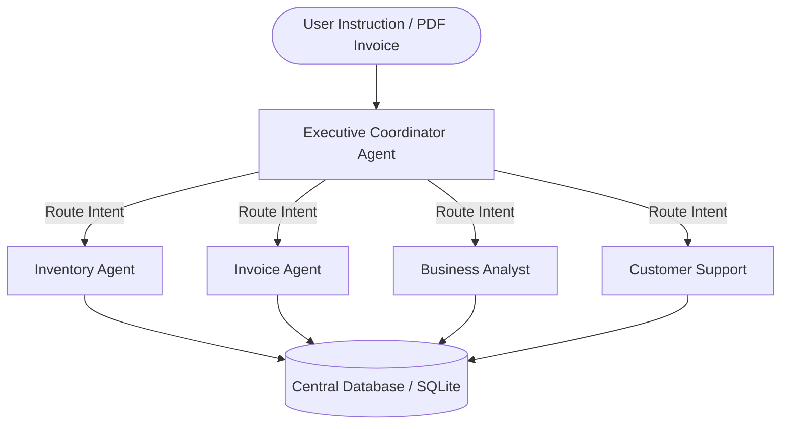

# BizPilot AI OS

> **The AI Operating System for Small Businesses.**
> A hackathon-winning multi-agent AI system designed to automate daily operations, logistics, invoicing, and analytics for SMEs.

---

## 🚀 Project Overview

BizPilot AI OS acts as an autonomous digital workforce for small business owners. Rather than managing separate systems for inventory tracking, invoicing, supplier communication, and financial reporting, BizPilot combines these into a single dark-themed, glassmorphic cockpit. The application uses specialized AI agents that collaborate to resolve operational issues in real time.

---

## ✨ Features

- **Multi-Agent Collaboration Engine**: Orchestrates execution logs between specialized agents.
- **Agent Collaboration Flow Graph**: Real-time SVG network visualizer showing the active communication path between the coordinator and specialists.
- **AI Action Timeline**: Chronological, step-by-step decision audit logs for full operations transparency.
- **Voice Mode**: Native browser Speech-to-Text integration. Say *"Hey BizPilot, reorder coffee beans"* or *"Check my business health score"* and watch it process automatically.
- **Invoice Upload & OCR Extraction**: Drag-and-drop invoice parser that extracts line items, registers customers, modifies stock levels, and flags shortages.
- **Business Health Score (0-100)**: Operational efficiency index calculated dynamically from safety stock limits and receivables, complete with actionable recommendations.
- **Daily CEO Briefing**: One-click operational diagnostic modal presenting MTD revenue, critical stock alerts, and quick action execution buttons.
- **Inventory CRUD & Safety Stock limits**: Interactive catalog table with automated reorder predictions.
- **CSV & Print-Ready PDF exports**: Download spreadsheet datasets or print visual PDF summary reports instantly.

---

## 🛠️ Tech Stack

### Frontend
- **Core**: React 18, TypeScript, Vite
- **Styling**: Tailwind CSS v4, Glassmorphism design tokens
- **Animations**: Framer Motion
- **Charts**: Recharts (Dynamic Area & Bar charts)
- **Icons**: Lucide Icons
- **HTTP client**: Axios

### Backend
- **Core**: FastAPI, Python 3.13
- **ORM / Database**: SQLAlchemy (connecting to SQLite locally, supports Supabase PostgreSQL fallback)
- **AI Orchestration**: Multi-Agent State-Machine architecture (simulated & OpenAI fallback)
- **OCR Parser**: `pypdf` text extraction layer

---

## 📁 Folder Structure

```
frontend/
  src/
    components/   # Reusable UI (cards, layouts, charts, agent collaboration canvas)
    layouts/      # Dashboard and Auth layouts
    pages/        # Dashboard, Inventory, Invoices, Orders, Reports, AI Employee, Analytics, Settings, Login, Signup, 404
    hooks/        # Custom react hooks (voice, api state)
    services/     # Axios API services
    context/      # AuthContext, ThemeContext
    types/        # TypeScript interfaces
    utils/        # Helpers (formatting, charting)
backend/
  app/
    routers/      # API endpoints (auth, inventory, invoices, orders, reports, analytics, chat)
    agents/       # LangGraph multi-agent logic or Simulation Engine
    services/     # OCR extraction, PDF generation
    database/     # DB connection and session configuration
    models/       # SQLAlchemy models
    schemas/      # Pydantic models
    utils/        # JWT helper, password hashing
docs/
  README.md       # Supporting documentation
```

---

## ⚙️ Installation & Local Startup

### Prerequisites
- Python 3.10+
- Node.js 18+

### 1. Start the Backend Server
From the root workspace directory:
```bash
# Install Python dependencies
python3 -m pip install fastapi uvicorn sqlalchemy python-jose[cryptography] passlib bcrypt pypdf email-validator openai

# Run the FastAPI server (listens on http://localhost:8000)
python3 -m uvicorn backend.app.main:app --host 127.0.0.1 --port 8000
```
*Note: On first boot, the backend automatically creates `bizpilot.db` (SQLite) and seeds initial dummy Cafe catalog data, including products, orders, and logs to ensure the app is fully populated out-of-the-box!*

### 2. Start the Frontend Application
Open a new terminal window at the root:
```bash
cd frontend

# Install package dependencies
npm install

# Build static assets (optional validation)
npm run build

# Start the Vite development server (listens on http://localhost:5173)
npm run dev
```

### 3. Log In to Dashboard
- Open `http://localhost:5173/` in your browser.
- Use the quick hackathon credentials provided on the login page:
  - **Email**: `admin@bizpilot.ai`
  - **Password**: `admin123`

---

## 🤖 AI Multi-Agent Architecture



1. **Executive Coordinator**: Entry gate for client directives. Parses intent and orchestrates specialist task allocations.
2. **Invoice Agent**: Extracts text content from invoice files, registers customer profiles, and updates inventory stock.
3. **Inventory Agent**: Evaluates stock safety thresholds, flags shortages, and automatically generates Purchase Orders.
4. **Business Analyst**: Computes revenue trends, calculates Business Health Score, and drafts the Daily CEO Briefing.
5. **Customer Support Agent**: Compiles order-tracking summaries and drafts email templates for customers.
